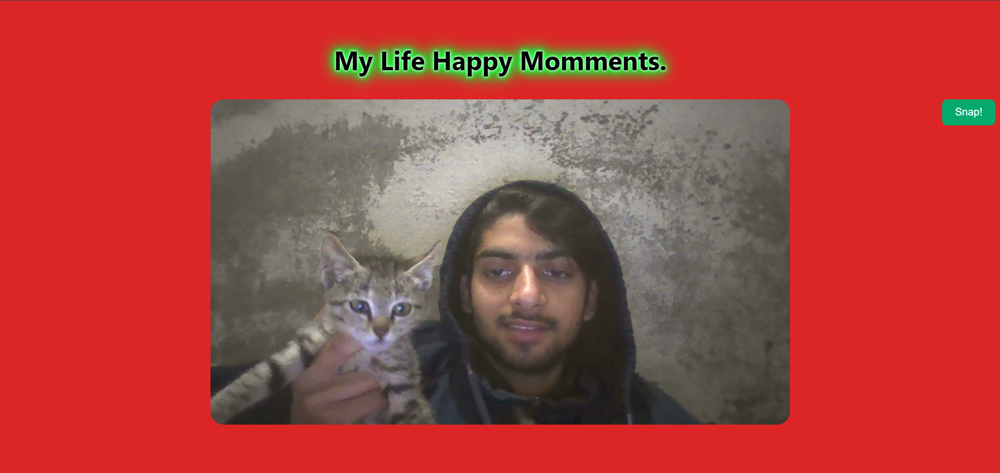

# javaScript-Part-II-advance-concepts
In this JavaScript repo we will be pushing the code of things that we'll learn during js revision and advancement of our knowledge of js

## What is ECMAScript

# Acutally this is my Journey with JS so Now, I wanted to make my learnin g interesting so that's why we will be creating extra ordinary things like 

## Look at this website 

